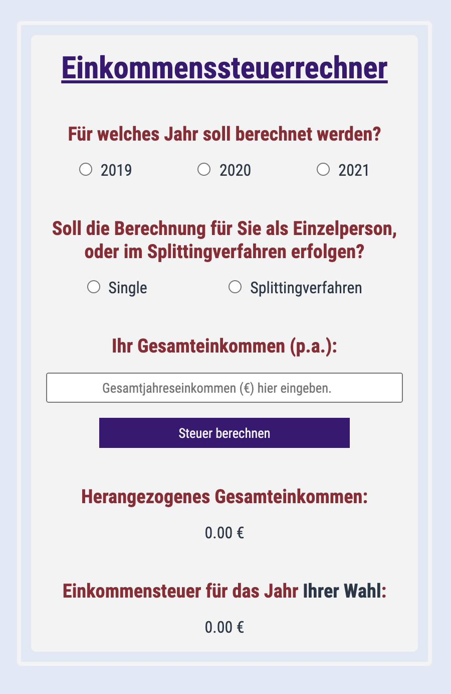

# Bootcamp Exercise - Tax calculator

## Table of contents

- [Overview](#overview)
  - [The challenge](#the-challenge)
  - [Screenshot](#screenshot)
  - [Links](#links)
- [My process](#my-process)
  - [Built with](#built-with)
  - [What I learned](#what-i-learned)
  - [Continued development](#continued-development)

## Overview

### The challenge

Users should be able to:

- Build a tax calculator
- It should be able to calculate singles and couples taxes 
- It should also be able to calculate taxes for several years

### Screenshot

### Links

- Solution URL: [https://stefanseliger.github.io/Projekt-Einkommenssteuer-Rechner/]

## My process

### Built with

- Semantic HTML5 markup
- CSS3
- SCSS / SASS
- JavaScript

### What I learned

How to code a web app, better understanding for if conditions, how to work with input fields and their values.   

### Continued development

Even more options to choose are thinkable, like other taxes. Maybe I could even find an API and integrate it. 

